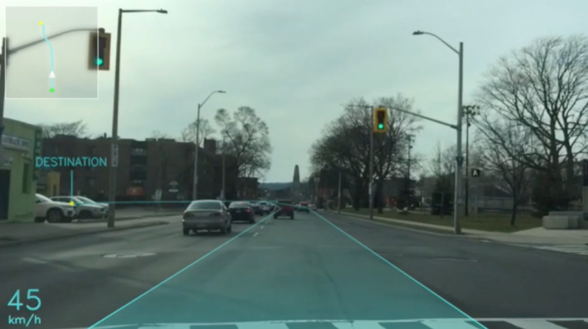
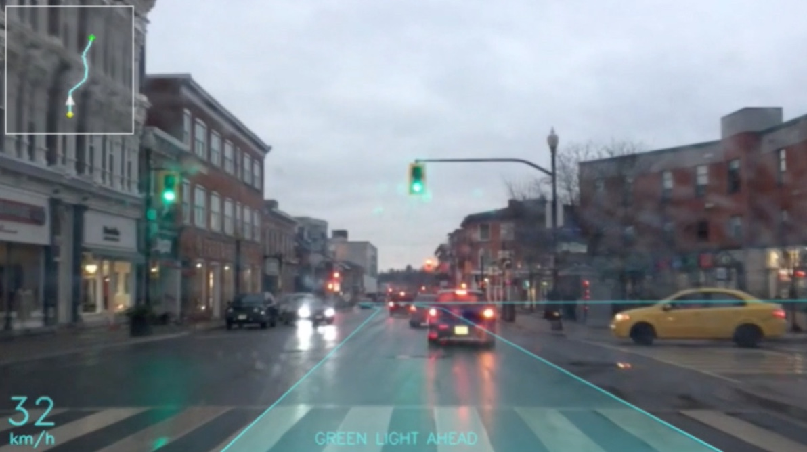
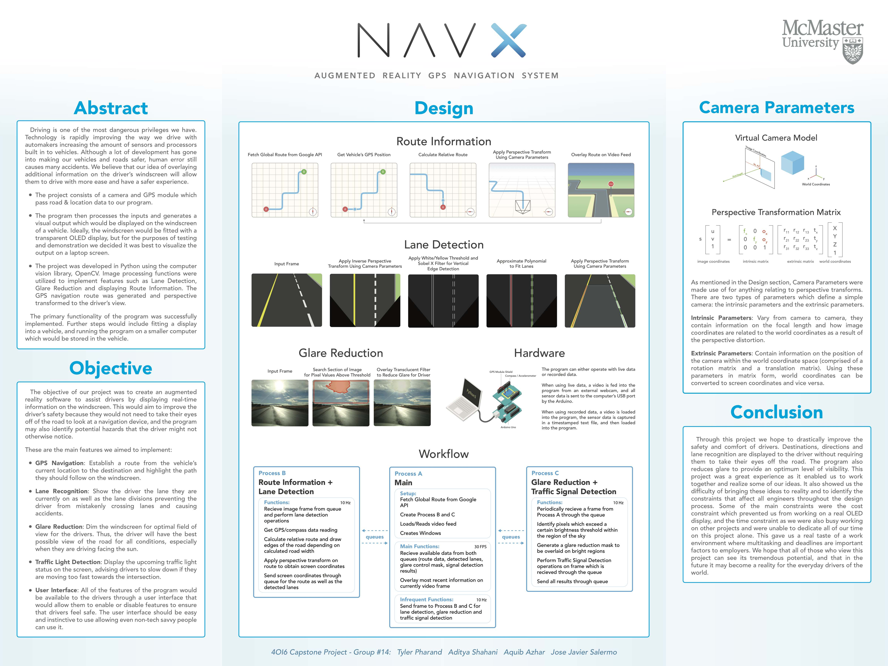

# NAVX: Final-Year Engineering Design Project
<b><i>Augmented Reality GPS Navigation System</i></b> 
2nd Place, Electrical Engineering. 

The goal of this project was to design an AR interface for GPS navigation. The program is fed video (30Hz) and sensory data (10Hz), the route to the destination is then hightlighted on the video using data fetched from the Google Maps API. Other features such as red light warnings, lane detection, glare reduction and overview map were also implemented. 

The program can handle live data, or prerecorded data. 
Some functions were written with Cython in order to improve runtime speed.  

<b>Components:</b>
<ul>
  <li>Python</li>
  <li>OpenCV</li>
  <li>Multiprocessing</li>
  <li>Google Maps API</li>
  <li>Arduino (Accelerometer/Compass, GPS Module)</li>
</ul>

# Screenshot A:

# Screenshot B:

# Poster:

